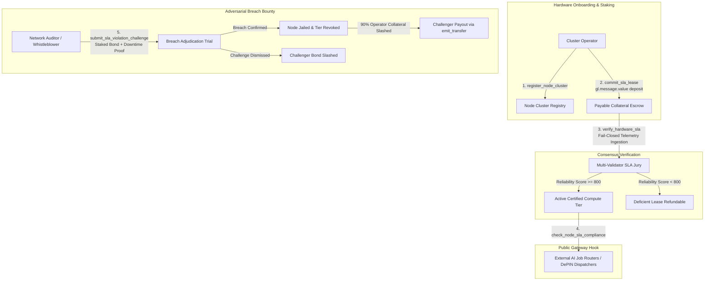

# DePINHardwareSlaSovereign: Autonomous DePIN Hardware Telemetry & Compute SLA Verifier

[](https://genlayer.com)
[](https://opensource.org/licenses/MIT)
[](test/test_depin_hardware_sla_sovereign.py)

**DePINHardwareSlaSovereign** is a persistent on-chain **Access Control Layer, Rate-Limiting Gatekeeper, and Hardware SLA Compliance Engine** engineered for Decentralized Physical Infrastructure Networks (DePIN) and GPU compute clusters (e.g. Render, Akash, io.net).

Unlike traditional two-party dispute courts, binary prediction bets, or simple escrows, this contract operates as a **reusable infrastructure primitive**. Autonomous multi-validator consensus continuously evaluates live cluster Prometheus/OpenTelemetry telemetry, certifies hardware SLA tiers ($0 - 1000$), and provides real-time gateway verification for external AI job dispatchers and compute orchestrators.

---

## Verified GenLayer Studio Testnet Deployment

| Parameter | Value |
| :--- | :--- |
| **Contract Name** | `DePINHardwareSlaSovereign` |
| **Contract Address** | [`0x7a67c62792Dffb8cdB4EBc2874858ed79d8418fc`](https://explorer-studio.genlayer.com/address/0x7a67c62792Dffb8cdB4EBc2874858ed79d8418fc) |
| **Deployment Tx Hash** | `0x7577334f176cb3e5b30d52df0624da14741911dd4d0b75241476af086d580f7e` |
| **Receipt Status** | `7` (`FINALIZED`) |
| **Explorer Link** | [https://explorer-studio.genlayer.com/address/0x7a67c62792Dffb8cdB4EBc2874858ed79d8418fc](https://explorer-studio.genlayer.com/address/0x7a67c62792Dffb8cdB4EBc2874858ed79d8418fc) |
| **RPC Endpoint** | `https://studio.genlayer.com/api` |
| **Public Gateway Check** | `check_node_sla_compliance(0x2222..., TIER_3)` $\to$ `True` (Verified Live) |

---

## Architecture Overview



---

## Key Technical Invariants

### 1. Verifiable Payable Escrow (`@gl.public.write.payable`)
All compute SLA leases and violation challenge bonds are funded strictly through payable transactions reading `gl.message.value`. Numeric input parameters are never trusted for monetary balance mutations.
- Tier 1 (`TIER_1_STANDARD_CPU`): 100 Gwei minimum collateral
- Tier 2 (`TIER_2_HIGH_MEM_RAM`): 500 Gwei minimum collateral
- Tier 3 (`TIER_3_GPU_TRAINING`): 2,000 Gwei minimum collateral
- Tier 4 (`TIER_4_HPC_DISTRIBUTED`): 5,000 Gwei minimum collateral

### 2. Non-Admin Consensus Block Time Expiration
Lease lifetimes and SLA challenge windows evaluate strictly against the consensus block timestamp:
$$\text{lease\_expires\_at} = \text{block\_timestamp} + \Delta t$$
Admin time-manipulation overrides (`advance_time`) are completely absent. External smart contracts querying `check_node_sla_compliance()` receive `False` immediately upon block expiration.

### 3. Fail-Closed Telemetry Ingestion
If external node Prometheus metrics or audit proof URLs fail to resolve, time out, or return empty responses ($< 10$ characters), execution cleanly reverts with:
```
AssertionError("[ERR_EVIDENCE_FETCH_FAILED] Live telemetry could not be fetched...")
```
The contract fails closed: state remains unmutated, compute capabilities are not unlocked, and collateral is never improperly slashed.

### 4. Public Gateway Hook for External Smart Contracts
Protocols integrate real-time on-chain gating by querying the public view gateway:
```python
@gl.public.view
def check_node_sla_compliance(self, node_address: str, required_tier: str) -> bool:
```
Checks:
1. Node exists and is not `SLASHED_JAILED`.
2. Node holds an `ACTIVE_CERTIFIED` compute lease.
3. Consensus block time is strictly $< \text{lease\_expires\_at}$.
4. Leased compute tier level meets or exceeds `required_tier`.
5. Current SLA reliability index $\ge 800$.

### 5. Adversarial Slashing Bounty
Network auditors submit reproducible downtime or forged telemetry logs via `submit_sla_violation_challenge()`. If consensus confirms a breach:
- The node is permanently marked `SLASHED_JAILED` and operational permissions revoked.
- 90% of operator locked collateral is slashed directly to the whistleblower via `emit_transfer()`.
- 100% of the challenger's deposited bond is refunded.

---

## SLA Scoring Rubric ($0 - 1000$)

Consensus validators evaluate telemetry across 4 orthogonal hardware health pillars:

| Evaluation Pillar | Score Range | Focus Metrics |
| :--- | :--- | :--- |
| **Network Uptime & Heartbeat** | $0 - 250$ | Ping regularity, packet drop rate $< 0.1\%$, socket responsiveness |
| **FLOPS Benchmark Fidelity** | $0 - 250$ | Sustained TFLOPS FP16/FP8, PCIe Gen5 bandwidth consistency |
| **Thermal Dissipation Margins** | $0 - 250$ | GPU junction temp $< 82^\circ\text{C}$, 0 thermal clock throttling events |
| **Memory & Attestation Proof** | $0 - 250$ | ECC error rate 0, cryptographically signed hardware manifest |

---

## Test Suite Execution

The 11-phase security regression suite validates all boundaries and invariants:

```bash
python test/test_depin_hardware_sla_sovereign.py
```

### 11-Phase Test Summary
1. **Phase 1**: Genesis Pre-Seeded Fixtures & Burned State Verification
2. **Phase 2**: Length-Prefixed Canonical SHA-256 Hashing & Delimiter Injection Resistance
3. **Phase 3**: Access Control, Counterparty Authentication & Frontrunning Defense
4. **Phase 4**: Verifiable Payable Staking Escrow & Tier Minimums
5. **Phase 5**: SSRF Neutralization & Strict Hex Address Validation
6. **Phase 6**: Stage 3 SLA Verification: Multi-Validator Telemetry Audit & Tier Certification
7. **Phase 7**: Fail-Closed Invariant: Telemetry / Proof Fetch Failure Aborts Without Altering State
8. **Phase 8**: Reusable Public Gateway Hook: Real-Time On-Chain SLA Compliance Verification
9. **Phase 9**: Stage 5 Adversarial SLA Breach Challenge & 90% Collateral Slashing
10. **Phase 10**: Stage 6B Non-Admin Block Time Expiration & Clean Collateral Release
11. **Phase 11**: Stage 6A/7 Single-Use Settlement, Anti-Tamper & Global Replay Defense
